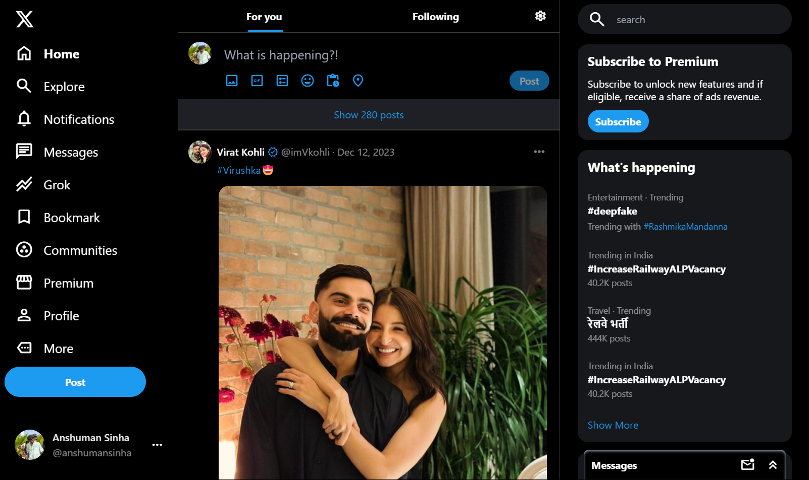

---

# Twitter Clone with Tailwind CSS

## Overview

This project is a Twitter clone that replicates the iconic Twitter UI using Tailwind CSS. It is designed to closely resemble the real Twitter interface while leveraging the power of Tailwind CSS for styling. The project is mobile-responsive, ensuring a seamless user experience on various devices.

## Features

- **Tailwind CSS Integration**: 80% of Tailwind CSS properties have been utilized to create a visually appealing and responsive design.
  
- **Mobile Compatibility**: The user interface is designed to be mobile-friendly, providing a consistent experience across different screen sizes.

- **Vite for Dev**: Vite has been used as the build tool for development, enhancing the development workflow and providing fast, efficient builds.

## Technologies Used

- **Tailwind CSS**: A utility-first CSS framework used for styling the entire project.

- **Vite**: A next-generation front-end tooling for modern web development.

## Getting Started

Follow these steps to get the project up and running on your local machine:

1. Clone the repository: `git clone https://github.com/theanshumansinha/TwitterX-clone.git`
2. Navigate to the project directory: `cd twitter-clone`
3. Install dependencies: `npm install`
4. Start the development server: `npm run dev`

## License

This project is licensed under the @anshumansinha.

## Acknowledgments

- The project was inspired by the Twitter interface.

---

